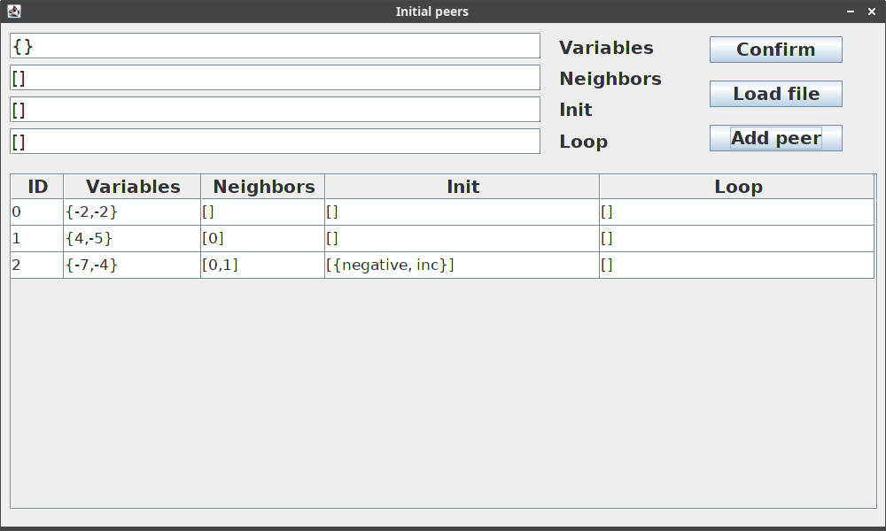
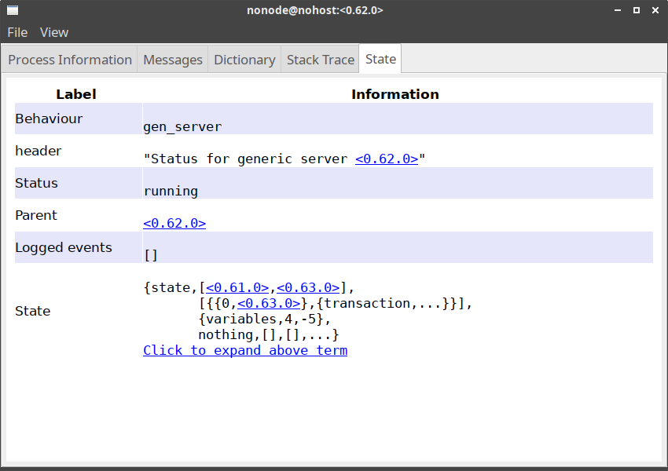

# progetto-corso-sistemi-distribuiti
Progetto sviluppato attraverso l'utilizzo di Erlang e di Java per il corso di "sistemi distribuiti" durante il percorso di laurea magistrale in informatica.  
Di seguito è riportata una breve descrizione della richiesta del progetto, per avere informazioni più complete sia riguardo la consegna sia riguardo la soluzione proposta si veda il [report](report.pdf) relativo.

## Descrizione
Diversi processi sono connessi tra di loro attraverso una rete della quale ogni nodo ha solo una visione parziale.  
Ogni processo della rete condivide con gli altri un insieme di <i>n</i> attributi <html>&#120016;</html> = {a1, a2, ... , a<i>n</i>} e possiede uno stato interno rappresentato dai valori associati a questi.  
Ogni processo deve poter comunicare con l'insieme dei processi, appartenenti alla rete, il cui stato soddisfa una certa condizione <html>&#120344;</html>. Ciò deve avvenire attraverso l'utilizzo di una funzione `send(Q,C)`, la cui semantica è la seguente: tutti i nodi della rete che soddisfano la condizione <html>&#120344;</html> devono eseguire <b>atomicamente</b> il comando <html>&#120330;</html>.  
La rete di nodi è altamente mutabile, ovvero l'entrata di un nuovo nodo o l'uscita di un nodo esistente possono avvenire in ogni momento.

## Screenshots
  
 
